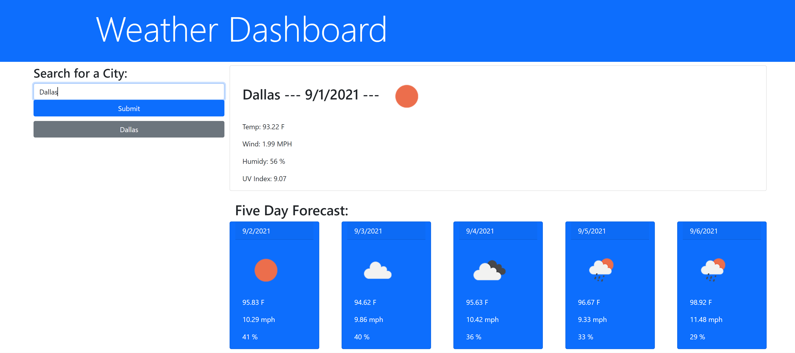

# Weather Dashboard

## Table of Contents:

### [Description](#description-header)

### [Installation](#installation-header)

### [Usage](#usage-header)

### [Licence](#licence-header)

### [Credits](#credits-header)

### [Questions](#questions-header)

---

 

##  Description

As a means of learning about APIs, a weather dashboard was created! After fetching the information through JavaScript, the API's response was drilled down to obtain the relevant data and then shown to the user through a dynamically updated HTML.

The purpose of this project was to create a weather dashboard, wherein a user can obtain the most up-to-date information on the weather for any particular city in the US. 

 

##  Installation

No installation required! For access to the fully functioning webpage application click the link [here](https://cperezba.github.io/Weather-Dashboard/).

 

##  Usage

Simply enter a city name to obtain current weather data and a five day forecast! Previous searches are saved and kept in a history query below the search bar for user reference.

 

##  Credits

Credit goes to the UTA Bootcamp for providing instruction and tools for learning Full-Stack Web Development. 

Credit also goes to [OpenWeather](https://openweathermap.org/), whose free weather API aided in this projects completion. 

 

##  Licence

Weather Dashboard is released under the MIT licence.

 

##  Questions

For more information and suggestions you can contact me at caperez317@gmail.com.

For a list of other projects and repos visit https://github.com/cperezba

---
